# InvigoPulse

Welcome to InvigoPulse - Your one-stop solution for both Inventory and Deadstock Management.

## Overview

Introducing "InvigoPulse" – your all-in-one solution for Inventory and Deadstock Management. Designed to streamline inventory control and deadstock processes, InvigoPulse offers a user-friendly interface and powerful features for businesses of all sizes.

### For Companies:
- Interactive inventory management platform to effectively manage company profiles and inventory.
- Features graphs, charts, and calendars for visualization on the dashboard.
- ML Algorithm forecasts demand for each product, reducing deadstocks.
- Put deadstocks at discounted prices on the e-commerce website to minimize losses.
### For Customers:
- E-commerce website to view and purchase products added by companies.
- Buy products at original prices or discounted prices for deadstocks.
- Add reviews and view past orders for a seamless shopping experience.

## Features

- **Inventory Management**: Easily track, organize, and manage inventory items with detailed information including inventory ID, brand, description, size, quantity, and more.

- **Deadstock Management**: Efficiently handle deadstock items, track their status, and manage them effectively to reduce wastage and maximize profits.

- **User Management**: Securely manage user accounts with features for authentication, authorization, and role-based access control to ensure data integrity and privacy.

- **Reporting and Analytics**: Gain insights into inventory performance with customizable reports and analytics, allowing for informed decision-making and strategic planning.

- **Integration**: Seamlessly integrate with existing systems and tools to enhance productivity and workflow efficiency.

## Getting Started

To get started with InvigoPulse, follow these steps:

### Prerequisites

Ensure you have the following software installed on your machine:

- Node.js
- npm (Node Package Manager)
- MySQL Server
- React Js

### Installation

1. Clone this repository to your local machine:

```bash
git clone https://github.com/ritu456286/InvigoPulse.git
```

2. Navigate to the `client` folder and install dependencies:

```bash
cd client
npm install
```

3. Navigate to the `backend` folder and install dependencies:

```bash
cd ..
cd backend
npm install
```

### Database Setup

1. **Modify Database Configuration**:
    - Before running the database connection scripts, navigate to the `backend/sql-connect` directory and modify the database configuration in each script (`dbcon1.js` to `dbcon7.js`). Change the `username` and `password` variables accordingly.

2. **Create Database**:
    - Create a database named `db` in your MySQL server.

3. Run each of the database connection scripts (`dbcon1.js` to `dbcon7.js`) in order to set up your database connection.

```bash
cd sql-connect
node dbcon1.js
node dbcon2.js
node dbcon3.js
node dbcon4.js
node dbcon5.js
node dbcon6.js
node dbcon7.js
```

### Running the Backend Server

1. After setting up the database connection, navigate back to the `backend` directory:

```bash
cd ..
```

2. Start the backend server:

```bash
nodemon index.js
```

The backend server should now be running on `http://localhost:3000`.

### Running the Client Application

1. Navigate to the `client` directory if you haven't already:

```bash
cd ../client
```

2. Start the client application:

```bash
npm start
```

The client application should now be running on `http://localhost:3000`.

## Usage

- Access the client application by navigating to `http://localhost:3000` in your web browser.
- Use the various features provided by InvigoPulse to manage inventory and deadstock efficiently.

## Snippets
### Landing Page
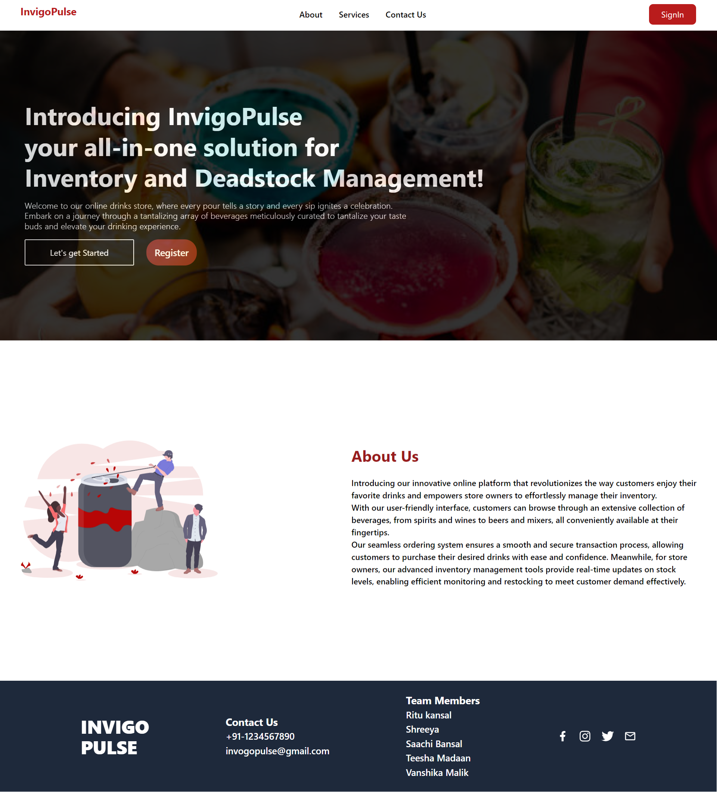

### Company Dashboard
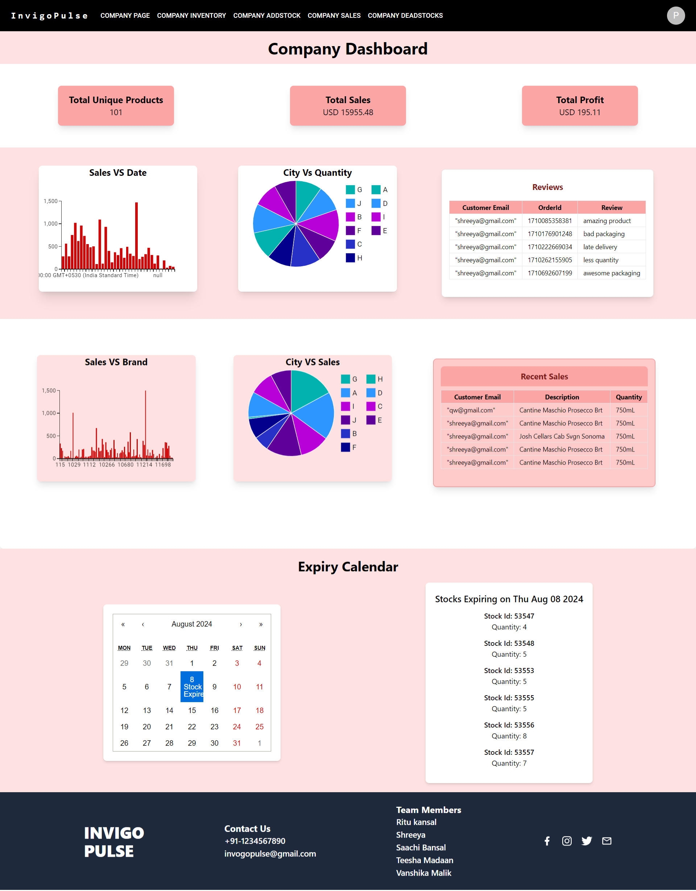

### Company Warehouse
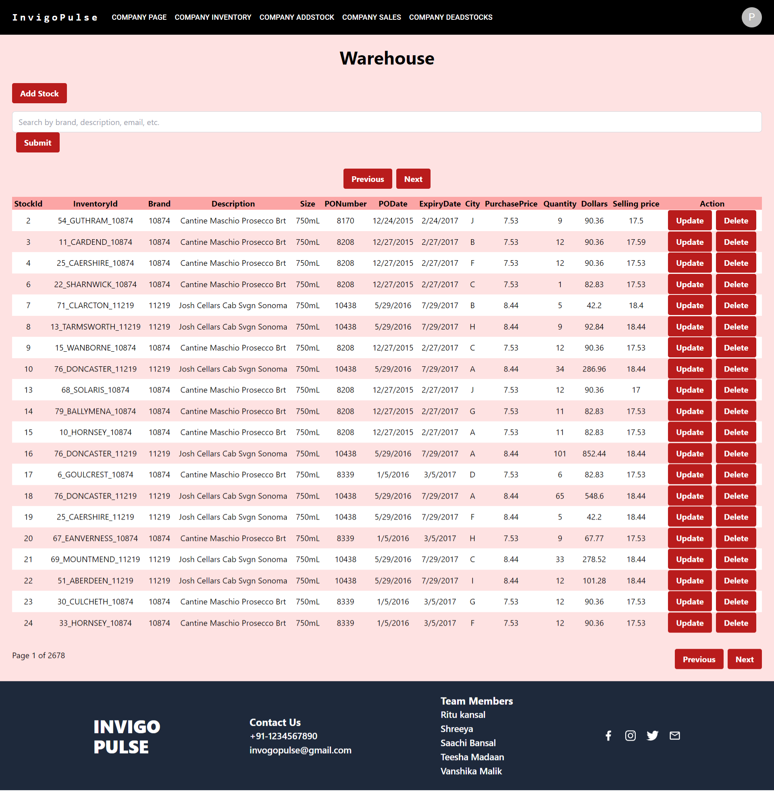

### Company Add Stock
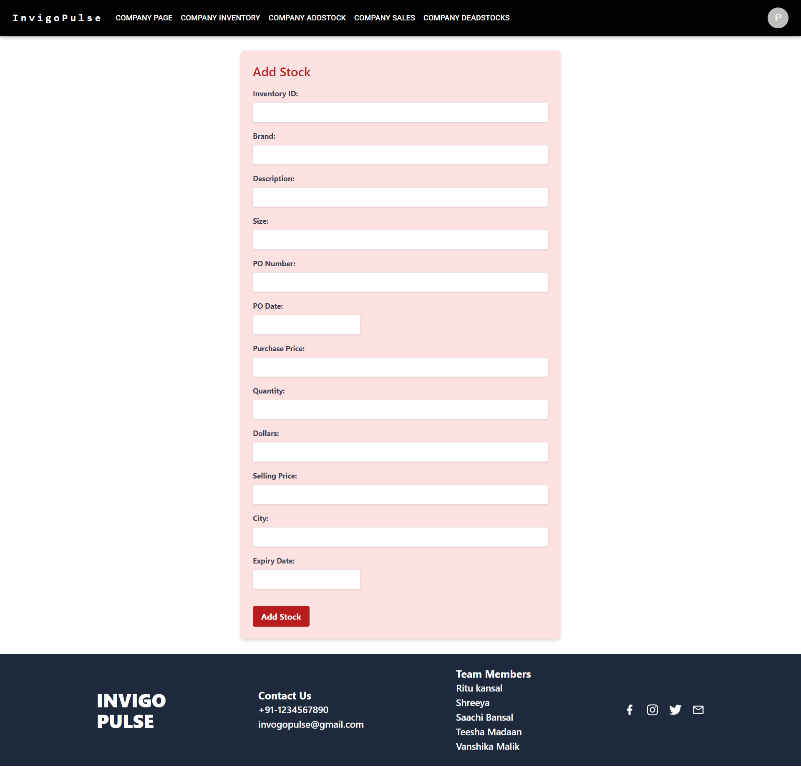

### Company Sales
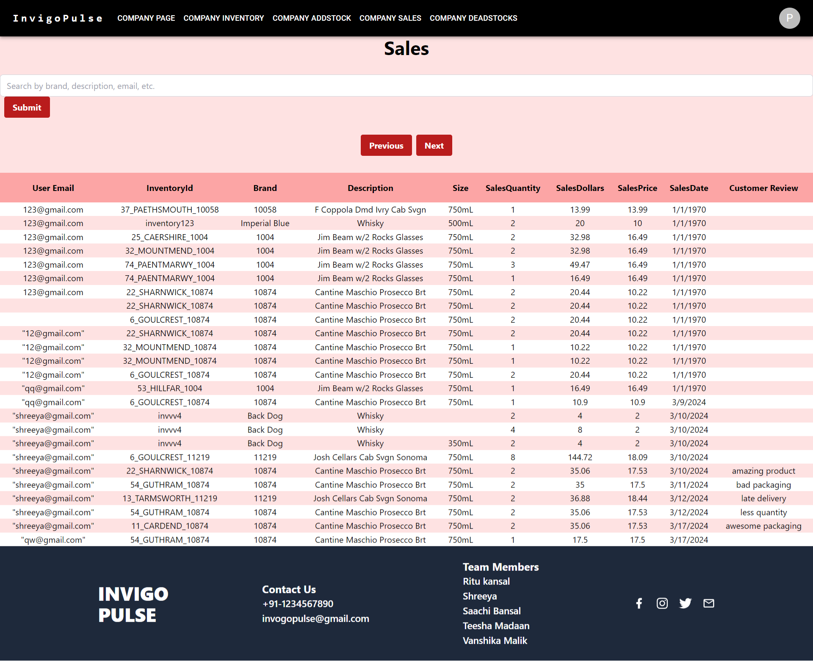

### Company Dead Stocks
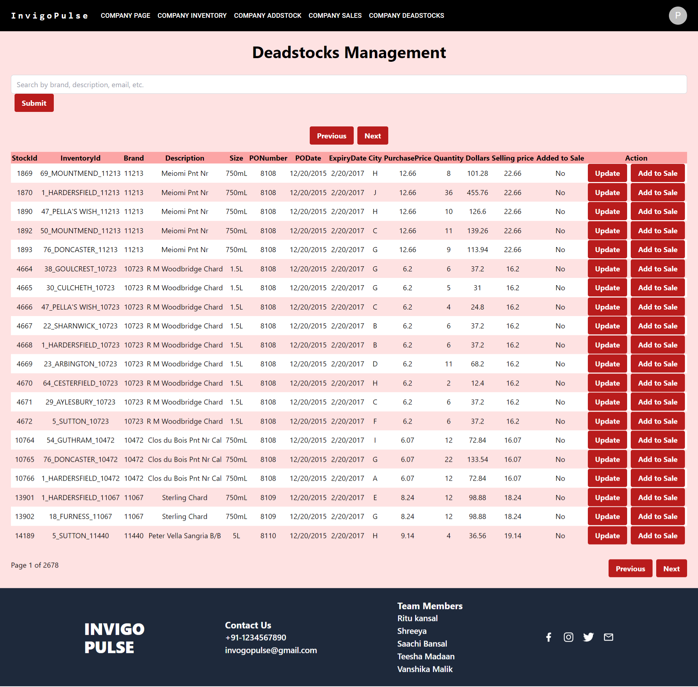

### Company Profile
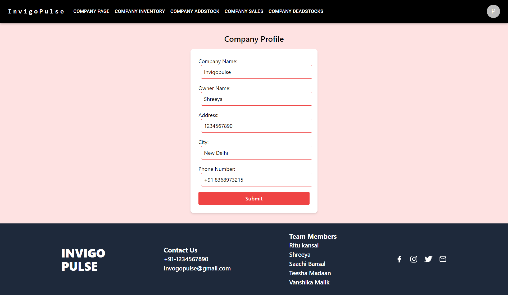

### Customer Browse
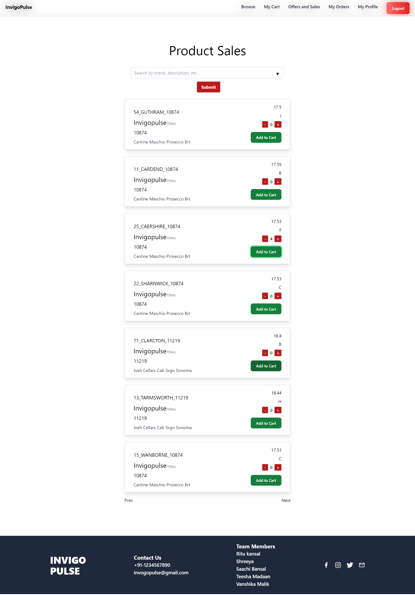

### Customer Cart
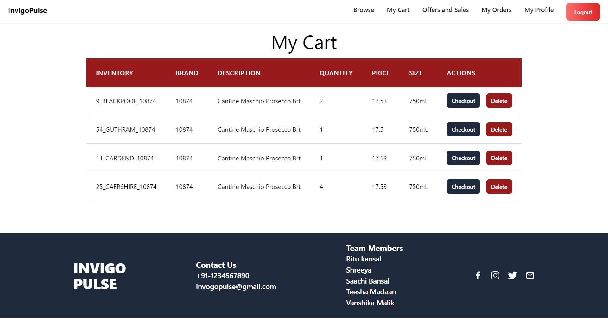

### Customer Orders
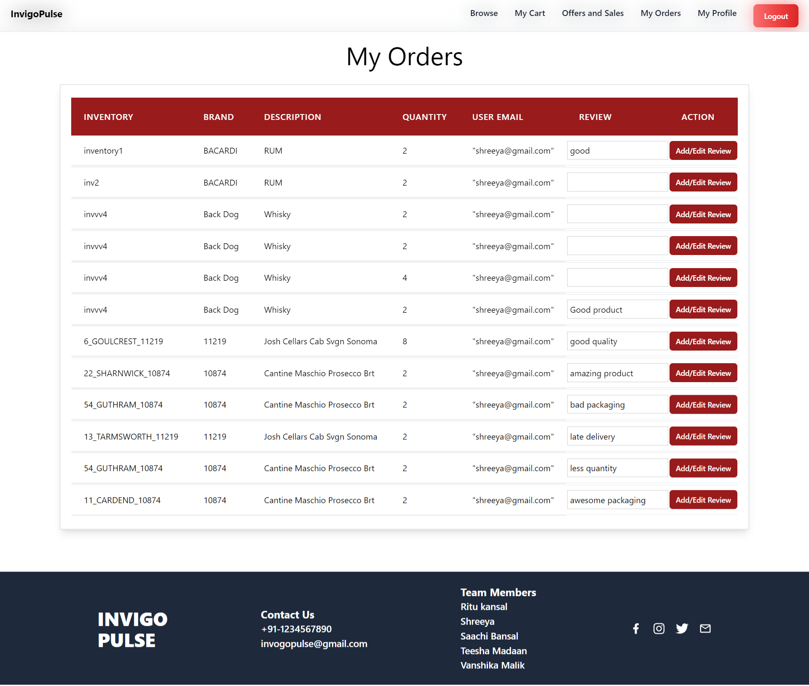

### Customer Offers and Sales
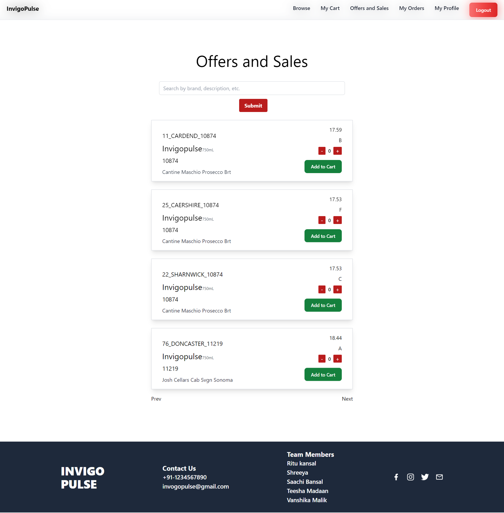

### Customer Profile
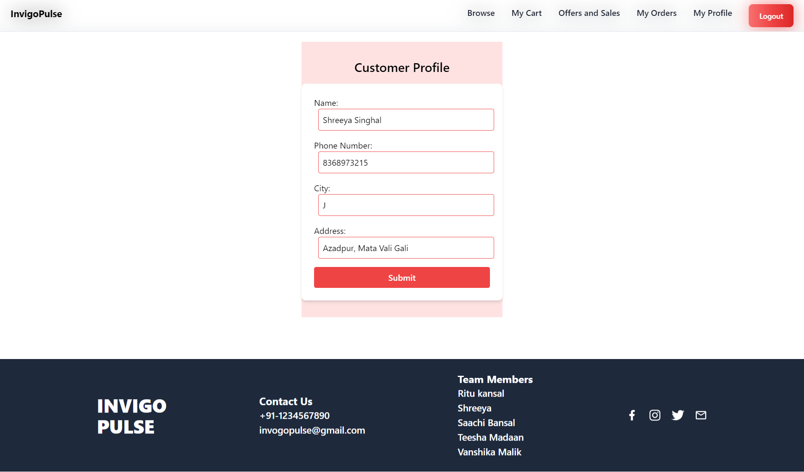
```

Make sure to adjust the MySQL username, password, and create the database as instructed before running the `dbcon` scripts.
